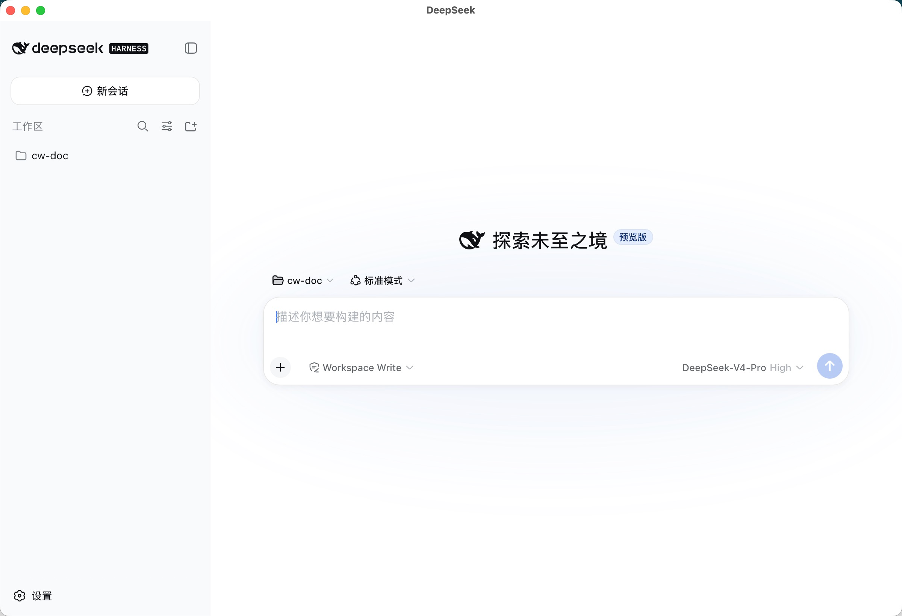

# DeepSeek Desktop

面向 DeepSeek Harness 的原生 macOS 工作台。界面采用 Codex Desktop 的工作方式：会话位于中央，环境信息独立显示在右侧，变更审查是单独面板，终端是可调整高度的底部抽屉。



## 已实现

- 原生 AppKit 窗口、工具栏、菜单、快捷键、状态栏与系统通知
- 工作区持久化、隔离任务/worktree、最近任务和归档任务
- 受管 DSH 服务：固定 `0.1.0-rc.7`、随机本机端口、健康检查、崩溃重启和进程身份校验
- Codex 风格的 DSH 页面主题、工作区切换、权限/模型入口与输入框聚焦
- 独立 Git 变更审查：Diff、暂存、取消暂存、放弃更改和提交
- 底部 PTY 终端：持久 shell、工作目录绑定、`⌃C` 和可滚动输出
- 右侧环境信息：变更行数、运行位置、分支和提交入口
- Sparkle 自动更新、签名、DMG、CI 与 GitHub Release 工作流
- DSH 运行时可随 App 打包，用户无需单独安装 Harness

## 快捷键

| 快捷键 | 功能 |
| --- | --- |
| `⌘B` | 切换会话侧栏 |
| `⌘⇧R` | 切换变更审查 |
| `⌘J` | 切换底部终端 |
| `⌘⇧I` | 切换右侧环境信息 |
| `⌘L` | 聚焦会话输入框 |

## 本地构建

要求 macOS 13+、Swift 6/Xcode Command Line Tools、Node.js 与 npm。

```bash
./scripts/test.sh
./build.sh
```

产物：

- `build/DeepSeek.app`
- `build/DeepSeek-2.0.0.dmg`

`./build.sh` 默认把固定版本 DSH 运行时嵌入 App。需要快速调试原生 UI 时可跳过运行时安装：

```bash
BUNDLE_DSH_RUNTIME=0 ./build.sh
```

## 服务解析顺序

App 启动时只管理自己创建的 DSH 进程，不占用固定端口，也不会终止用户已有的服务。运行时按以下顺序解析：

1. App 内嵌运行时
2. `DSH_BIN` / `DSH_NODE` / `DSH_NPX` 显式配置
3. 已验证的本机 npm/npx 缓存或安装
4. 固定版本的 `npx` fallback

服务仅监听 `127.0.0.1` 的随机端口，并绑定到当前工作区。

## 发布

正式发布前需要配置 Sparkle Ed25519 公钥、Developer ID 签名身份和 notarization 凭据；仓库内的 `SUPublicEDKey` 当前是占位值。发布脚本：

```bash
SIGN_IDENTITY="Developer ID Application: ..." \
SPARKLE_PUBLIC_KEY="..." \
./scripts/release.sh
```

## 主要目录

```text
Sources/       AppKit、WebKit、Git、终端与 DSH 服务代码
Runtime/       固定 DSH 运行时依赖锁
Tests/         核心逻辑与 PTY 终端冒烟测试
scripts/       测试、发布及受控 DSH 补丁
.github/       CI 和 Release 工作流
```
